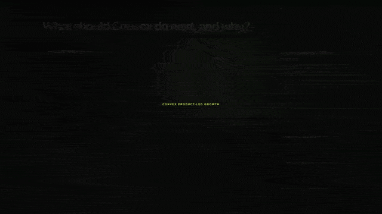

# Help the right team at the right moment

## A product-led growth decision tool for Convex



## The promise

> **As a Marketing decision-maker, when a Convex team shows credible signs that it is becoming serious, I want one clear review that explains why it matters now and helps me choose the right human next step — so we can be useful without being premature, repetitive, or intrusive.**

This is not a lead score and it is not an automatic outreach machine.

It is a calm place to answer one practical question:

> **What should Convex do for this team next, and why?**

## The story

A small team can start using Convex quietly. That is normal. They might be trying an idea, shipping a new feature, or learning the product.

Then something changes. The project is in production. More people join. Usage stays meaningful over time. Maybe the team is pushing against a real limit. Maybe someone asks about SSO, security, a contract, or procurement.

That is the moment this tool is built for.

Rather than dumping raw activity into a spreadsheet or sending an automatic sales message, it creates **one shared review** for the people at Convex who need to make a thoughtful call. The review shows the evidence, recommends the next move, and keeps the decision human.

## What a reviewer can do

### See why a team appeared

Every review uses plain language. A reviewer can see whether the team has a real production app, whether the work is spreading across people, and what changed recently.

### Tell early momentum from an urgent moment

| What is happening | What the team at Convex should do |
| --- | --- |
| The team is growing steadily, but has not asked for help | **Observe.** Do not turn healthy adoption into unwanted outreach. |
| The team is running into sustained, confirmed capacity pressure | **Review the commercial play.** Decide whether help with scale or plan choice would be useful. |
| The team asks an enterprise-style question — for example about SSO, security, legal, or procurement | **Assign a technical response.** Make sure the right person can help quickly. |

### Make one decision, together

A team receives one shared review, even if several people at Convex need to see it. If the team later reaches a more urgent moment, the original review is updated rather than duplicated.

The reviewer can pause a team, mark it as already owned, or suppress it when contact would be inappropriate. When a response is appropriate, the tool prepares a **customer-facing draft** — not an internal to-do list.

## What this deliberately does *not* do

- It does not contact a customer automatically.
- It does not turn incomplete or uncertain information into a sales signal.
- It does not use customer code, databases, documents, secrets, or end-user information.
- It does not claim access to Convex customer data.
- It does not replace the existing support, commercial, or messaging tools.

The demo uses clearly labeled made-up teams and test-only delivery. That lets the decision rules be tested without pretending that real customer access or permission already exists.

## Try the demo

1. Start the local app.
2. Choose a scenario in the **Sandbox playground**.
3. Open a team review.
4. Read the evidence and choose **Prepare response**.
5. See the customer draft and the test-only delivery preview.

```sh
npm install
npx convex dev
```

In a second terminal:

```sh
npm run dev
```

Open the local address shown in the terminal. No real message will be sent.

## How I made it trustworthy

The user experience is simple because the guardrails are not.

- A team must have confirmed identity, real production activity, evidence of shared adoption, and complete usage history before it can be reviewed.
- A no-contact request, partner-managed relationship, existing owner, open case, or cooldown stops the review.
- The same team cannot become several competing reviews when several events arrive at once.
- A simulated delivery failure stays visible and recovers once without creating a duplicate success.
- Every decision leaves a history that can be reviewed later.

The project includes scenarios for successful cases, missing or weak evidence, suppressions, route upgrades, duplicate events, delivery recovery, and heavier load.

## For people who want to look under the hood

The app uses React and Convex. The policy is written as readable, deterministic rules rather than a black-box score.

| Start here | What you will find |
| --- | --- |
| [`src/App.tsx`](src/App.tsx) | The review queue, evidence view, customer-reply draft, and delivery preview. |
| [`src/policy.ts`](src/policy.ts) | The rules for what qualifies, what is held, and what is suppressed. |
| [`src/fixtures.ts`](src/fixtures.ts) | The made-up scenarios used to prove normal and edge-case behavior. |
| [`convex/reviews.ts`](convex/reviews.ts) | The saved review, evidence, decisions, and safe demo reset. |
| [`test/`](test) | Checks for decision quality, duplicate prevention, delivery recovery, and workload. |

Useful local checks:

```sh
npm test
npm run check
npm run build
npm run verify:demo-reset
npm run verify:local
```

The last two commands exercise the saved local workflow. They reset only demo data and run the full scenario pack without contacting Slack, email, or another outside service.

## What would need to happen before this could be real

A real version would need named source owners, approved access, clear definitions for every field, privacy and retention approval, a reliable no-contact and ownership check, and explicit approval for every delivery channel.

That work is intentionally outside this prototype. The point here is to show a thoughtful, testable way to turn product momentum into a respectful human decision — not to pretend those approvals are already in place.
