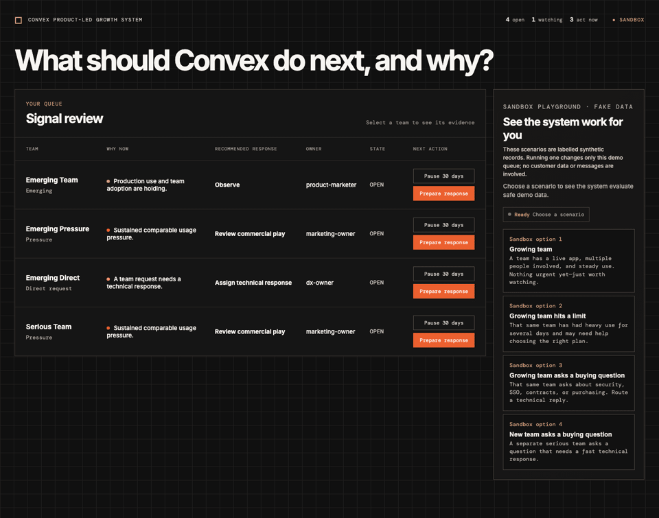
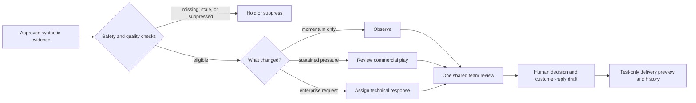

# Convex Product-Led Growth Signal Review

> A small, explainable decision system for turning team-level product signals into the next **human** response — without pretending that a score, a dashboard, or an automated message is a relationship.

[](docs/media/video/convex-plg-premium-demo.mp4)

**[Watch the walkthrough](docs/media/video/convex-plg-premium-demo.mp4)** · The preview above follows a synthetic team from early momentum to a customer-ready reply. Nothing in the demo is sent to a customer.

## Why this exists

A product-led company often notices meaningful activity too late, or reacts to a noisy signal too early. This prototype asks a more useful question:

> **What should we do next for this team, and what evidence supports that choice?**

Instead of producing a generic lead score, the system creates one shared team review. It shows what changed, recommends the appropriate human response, identifies the responsible person, and keeps the reasoning visible.

This is a portfolio prototype for the GTM Engineer problem space. It is deliberately built with labeled synthetic teams and test-only delivery so that the product logic, safety rules, and operating model can be evaluated without claiming access to real Convex customer data.

## What the reviewer should notice

- **The policy is explainable.** Every queued team has plain-language evidence rather than an opaque score.
- **The system distinguishes interest from urgency.** Early team momentum is worth watching; sustained pressure or an explicit enterprise request is a reason to act.
- **The response stays human.** The app prepares a customer-facing reply and a delivery preview. It does not send email or Slack messages.
- **The system is designed for operational reality.** It records decisions, prevents duplicate cases, preserves recipient choices, handles a simulated delivery failure, and protects suppressed or already-owned teams.

## How a team moves through the system



### The decision rules, in plain English

Before a team can appear in the queue, the prototype requires:

1. a confirmed team identity and authorized source records;
2. a current production deployment and evidence that more than one person is involved;
3. three complete, team-attributed days of usage; and
4. no no-contact request, partner-managed relationship, existing owner/open case, or active cooldown.

Once those foundations are present, the review is routed by the strongest current signal:

| Situation | Recommendation | Intended human response |
| --- | --- | --- |
| Healthy momentum, but no urgent need | **Observe** | Keep an eye on the team without premature outreach. |
| Sustained pressure against a confirmed team limit | **Review commercial play** | Decide whether plan or scaling support would be useful. |
| An open, authorized security, SSO, legal, procurement, contract, or similar request | **Assign technical response** | Prepare a helpful technical reply and route it to the right owner. |
| Both pressure and a direct request | **Assign technical response** | Treat the direct request as urgent while retaining the pressure evidence. |

If an emerging team later develops pressure or makes a direct request, the existing review is upgraded rather than duplicated.

## What is actually built

The app is a React interface backed by Convex. The live local path is:

1. Load a labeled fixture.
2. Evaluate the policy and persist the review, evidence, recipient targets, and history.
3. Show the review in a real-time queue.
4. Let a reviewer prepare a reply, pause the team, or suppress it with an explanation.
5. Record a test-only delivery outcome and recovery history.

The backend keeps separate records for teams, evidence, evaluations, reviews, recipient targets, delivery attempts, and team-level policy state. This makes the decision inspectable and helps prevent an upgrade, retry, or duplicate event from silently creating a second case.

## Safety boundary

This project does **not** use real customer, application, or end-user data. It does **not** ingest or display customer application code, databases, schemas, documents, environment values, or secrets. It does **not** send real Slack, email, or outreach.

Those boundaries are intentional. A real rollout would need approved data sources, field definitions, permitted-use and retention decisions, least-privilege access, an authoritative owner/no-contact check, and explicit approval for each live delivery channel. The prototype is evidence that the policy and workflow can be exercised safely — not evidence that those production approvals already exist.

## Run it locally

```sh
npm install
npm test
```

To use the full local app, start Convex and the web app in separate terminals:

```sh
npx convex dev
npm run dev
```

Then open the local URL shown by Vite. The **Sandbox playground** loads clearly labeled fake scenarios; choose an option, open a team, and select **Prepare response** to see the customer-reply draft.

### Useful checks

```sh
# Reset only visible demo records; unrelated test records remain untouched.
npm run verify:demo-reset

# Exercise the persisted local Convex path across all fixtures and controls.
npm run verify:local

# Run policy/unit tests, type checking, and a production build.
npm test
npm run check
npm run build
```

The persisted verification covers 24 fixtures, route upgrades, recipient snapshots, a five-way duplicate race, simulated failure and recovery, and a ten-times workload. The delivery test records synthetic outcomes only; it never connects to Slack or email.

## Project map

| Where to look | Why it matters |
| --- | --- |
| [`src/App.tsx`](src/App.tsx) | The reviewer queue, evidence drawer, reply draft, and delivery preview. |
| [`src/policy.ts`](src/policy.ts) | The readable, deterministic rules behind each recommendation. |
| [`src/fixtures.ts`](src/fixtures.ts) | Labeled scenarios for normal, hold, suppression, upgrade, and edge cases. |
| [`convex/reviews.ts`](convex/reviews.ts) | The persisted Convex workflow and safe demo reset. |
| [`test/`](test) | Regression coverage for policy behavior, duplication, delivery recovery, and workload. |
| [`docs/demo-storyboard.md`](docs/demo-storyboard.md) | A short, human-readable walkthrough of the product story. |
| [`docs/portfolio-introduction.md`](docs/portfolio-introduction.md) | A concise explanation of the project’s GTM Engineer relevance. |

## Design sources and honest limitations

The build follows a V1 design for an explainable named-team review: confirmed identity, production momentum, shared adoption, complete usage, direct intent or pressure, and clear stop conditions. The detailed research notes are intentionally kept outside this shareable repository because they include planning material rather than implementation documentation.

The prototype implements the policy with synthetic fixtures, including the emerging-team route and upgrades into urgent routes. It has **not** been production-verified. A future production system would need to complete its source-access, privacy, security, and delivery approvals before using real named-team information or contacting anyone.

## Technology

- React + TypeScript + Vite
- Convex database, queries, mutations, and scheduled test-only delivery work
- Vitest for policy and sandbox regression tests
